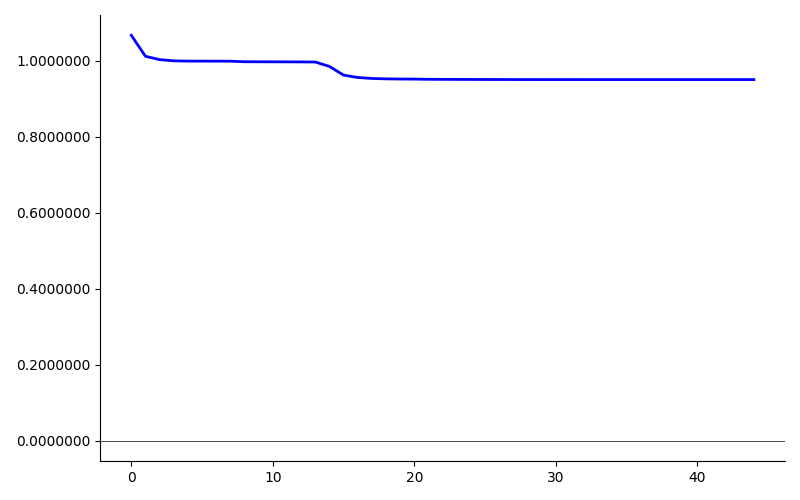
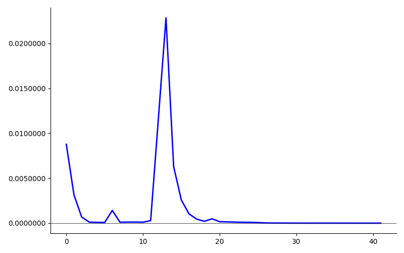

Example of a structure of a Neural Network using Proximal Policy Optimization.
Programmed using a guide from https://youtu.be/Wo5dMEP_BbI?si=ohs4ktQBqep1QmF0.

## Usage

You can start the programm by calling the `main.py` script:

    python3 PythonApplication1/main.py

After the execution you find this two graphs as result.

The graphs could look like this:

Advaced usage:

You can adjust both the number of iterations and the magnitude by which the weights and biases are updated in each iteration by using the following parameters.

* `-i` - Number of iterations (positive value > 0, default 10000)
* `-m` - magnitude (floating point value, default 0.05)

Here is an example:

    python3 PythonApplication1/main.py -i 

## Prerequsites

* Python version: 3.9.6 
* NumPy version: 2.0.2 
* Matplotlib version: 3.9.4

